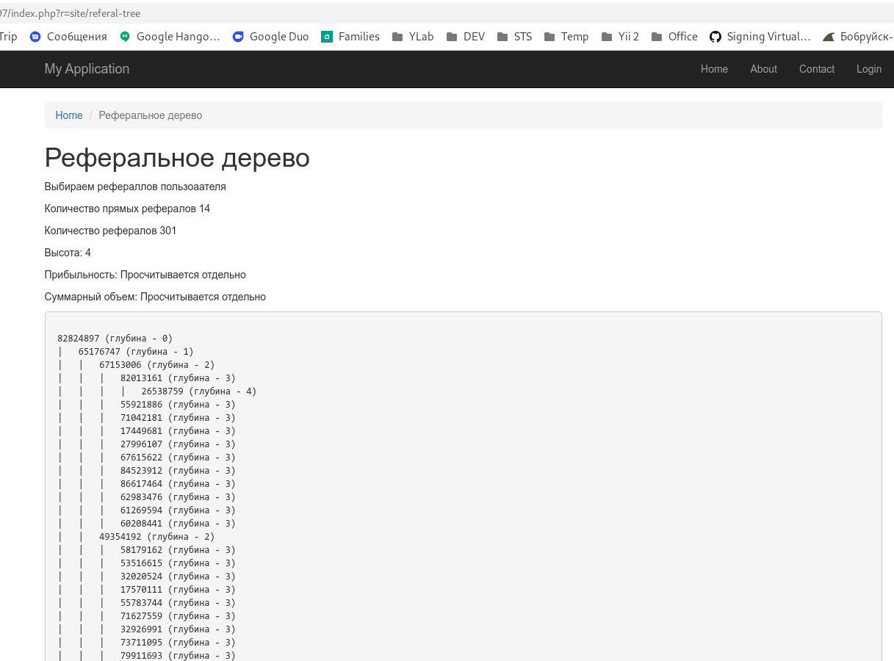
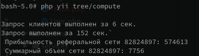

# Тестовое задание для Tifia.com

### Вводная информация
В нашем сервисе клиенты представлены в таблице `Users`. Каждый клиент может открыть до 12 счетов. Счета хранятся в таблице `Accounts`, каждый счёт связан с определенным клиентом. На любом из счетов может быть торговля. Торговые операции представлены в таблице `Trades`.

Очень часто нам приходится строить дерево партнера, опираясь на поле `partner_id` в таблице `Users`. Под партнерским деревом понимается структура, в вершине которой находится заданный клиент. Под ним находятся другие клиенты, у которых `User2[partner_id] = User1[client_uid]`, у `User2` могут быть еще рефералы (те, у кого в `partner_id` стоит `User2[client_uid]`). Если `partner_id = 0`, это означает, что клиент не входит ни в чью реферальную сетку, но может быть корнем своей сети.

### Задачи
* Проанализировать базу данных, указать узкие места.
* Построить дерево рефералов на основе поля `partner_id` таблицы `Users`
* Написать скрипт, способный обсчитать реферальную сетку партнера по следующим критериям:
	* посчитать суммарный объем `volume * coeff_h * coeff_cr` по всем уровням реферральной системы за период времени
	* посчитать прибыльность (сумма `profit`) за определенный период времени
	* посчитать количество прямых рефералов и количество всех рефералов клиента
		* [под прямыми рефералами понимаются те, у кого в `partner_id` стоит `client_uid` клиента]
		* [под всеми рефералами понимается совокупность всех прямых рефералов, их прямых рефералов и т.д. до клиентов, под которыми нет рефералов]
	* посчитать количество уровней реферальной сетки
	* при выполнении задания _нужно использовать_ фреймворк Yii2

Примечание: период времени определяет интервал поля `close_time` таблицы `Trades`

**Для удобства**, можно обсчитать клиента с `client_uid = 82824897`

###### Пример построения дерева
| id  | client_uid  | partner_id  |
| :------------: | :------------: | :------------: |
|  1 | 123 | 0  |
|  2 | 456 | 0  |
|  3 | 312 | 0  |
|  4 | 471 | 123  |
|  5 | 965 | 123  |
|  6 | 892 | 965  |
|  7 | 111 | 456  |
|  8 | 222 | 111  |
|  9 | 333 | 111  |

По данному набору клиентов можно построить следующую реферальную сеть:
```bash
├── 123
│     ├── 471
│     ├── 965
│            ├── 892
├── 456
│     ├── 111
│            ├── 222
│            ├── 333
├── 312
```
У клиента с `client_uid = 123` - 2 уровня реферальной сети.

У клиента с `client_uid = 965` - 1 уровень реферально сети.

### Таблицы
- Users
- Accounts
- Trades

###### Users
|  id  | client_uid | email  | gender  | fullname  | country  | region | city | address | partner_id  | reg_date  | status  |
| :------------: | :------------: | :------------: | :------------: | :------------: | :------------: | :------------: | :------------: | :------------: | :------------: | :------------: | :------------: |
| int  | int | string  | string | string  | string(2)  | string | string | string | int  | datetime  | int  |

###### Accounts
| client_uid  | login  |
| :------------: | :------------: |
| string  | string  |

###### Trades
| id | ticket  | login  | symbol  | cmd  | volume  | open_time  | close_time |  profit  | coeff_h  | coeff_cr  |
| :------------: | :------------: | :------------: | :------------: | :------------: | :------------: | :------------: | :------------: | :------------: | :------------: | :------------: |
| int | int  | int  | string  | int(1)  | float  | datetime  | datetime  | float  | float  | float  |

Примечание: Не разрешается добавлять новые столбцы и таблицы. Тестовую базу данных можно улучшать.


1. Не хватает индексов. Как минимум по `partner_id` таблицы User. По идее, таблица должна изменяться не часто, так 
   что добавление индексов сильно замедлить систему не должно.
   ```
   CREATE INDEX user_idx ON users(partner_id, client_uid)
   ```
   Вполне возможно поможет добавление индексов в таблицу `accounts`.
   Добавление индексов в таблицу `trades` замедлин изменение данных в это таблице.
   Для увеличения скорости следует ввести кэшировние, например, через redis или ELK.
   
   Обсчет реверальных сетей стоит внедрить в бизнес-логику, чтобы из базы доставать готовые значения, а не высчитывать 
   их.
   
2. Запрос на данные для дерева
   - вариант 1 - используем рекурсивный запрос
     ```
     WITH RECURSIVE rels (client_uid, partner_id, id, fullname, email) AS (
         SELECT client_uid, partner_id, id, fullname, email
         FROM users
         WHERE client_uid = '82824897'
         UNION ALL
         SELECT u2.client_uid, u2.partner_id, u2.id, u2.fullname, u2.email
         FROM users u2 JOIN rels u1 ON u2.partner_id = u1.client_uid
     )
     SELECT client_uid, partner_id, id, fullname, email 
     FROM rels 
     GROUP BY client_uid, partner_id 
     ORDER BY id;
     ```
   - вариант 2 - подзапросы, формиуем на php нужную вложенность.
     ```
     $sql = 'SELECT u.client_uid, u.partner_id, u.email, u.fullname FROM users u WHERE u.client_uid IN (%s)';
     $recursive[0] = "SELECT u0.client_uid FROM users u0 WHERE u0.client_uid = {$id}";
     for ($i = 1; $i <= $deep; $i++) {
         $recursive[] = sprintf("SELECT u{$i}.client_uid FROM users u{$i} WHERE u{$i}.partner_id IN (%s)", $recursive[$i-1]);
     }
     $sql = sprintf($sql, implode(' UNION ALL ', $recursive));
     ```
3. Обсчет дерева
   - Построение дерева и обсчет некоторых параметров:
     ```
     GET /index.php?r=site/referal-tree
     ```
     Дерево строится около 6 секунд.
     
     
    
   - обсчет показателей по операциям идек в консоле, так как операция долгая, в runtime обсчитать не получиться.
     ```
     php yii tree/compute
     ```
     Обсчет 2-х дней идёт где-то 150-180 секунд.
     
     